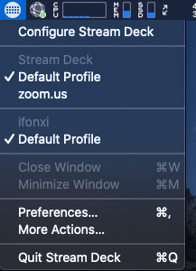
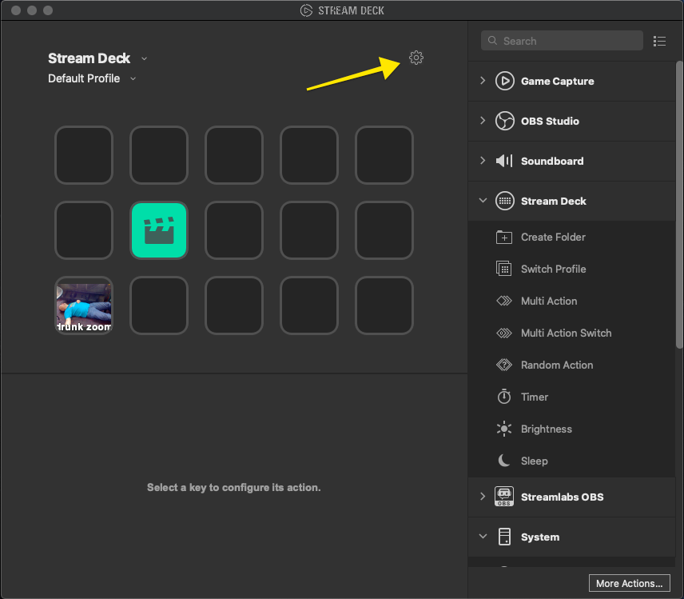
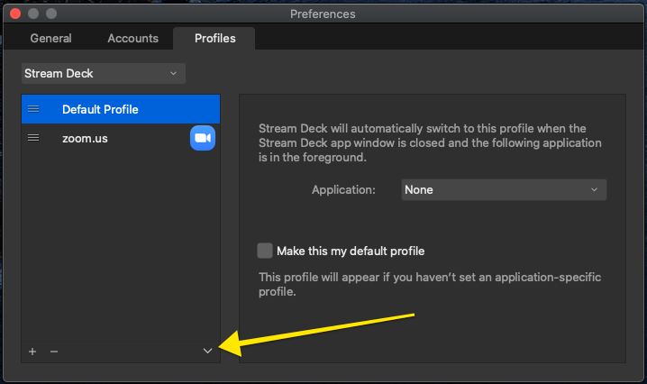
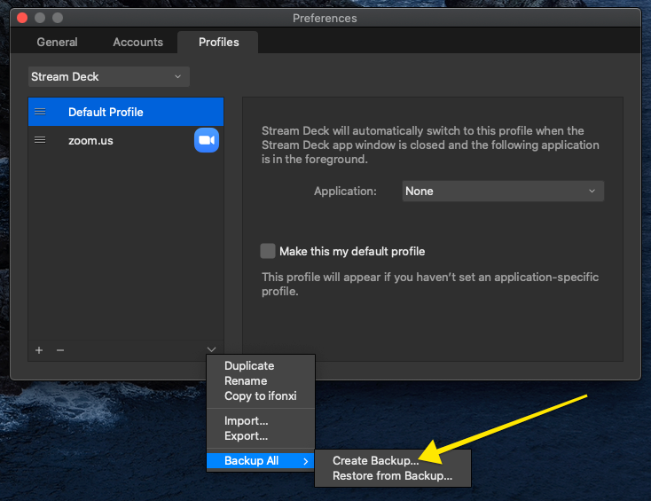

# streamdeck-config
  - From the Stream Deck App, choose `Configure Stream Deck`



  - Click the Settings Gear to open the Preferences Dialog



  - Click the Pull-Down inverted carat



  - Navigate to Create Backup



  - Place the backup file in the `backups/` directory in this repository, it will be ignored by git, so save the backups elsewhere if you want to use it for a backup
  - The files are `Zip archive datat, at least v2.0 to extract` so unzip it into the config directory

```
unzip -o ../backups/Stream\ Deck\ -\ 12-02-2021\ -\ 12-07.streamDeckProfilesBackup
```


